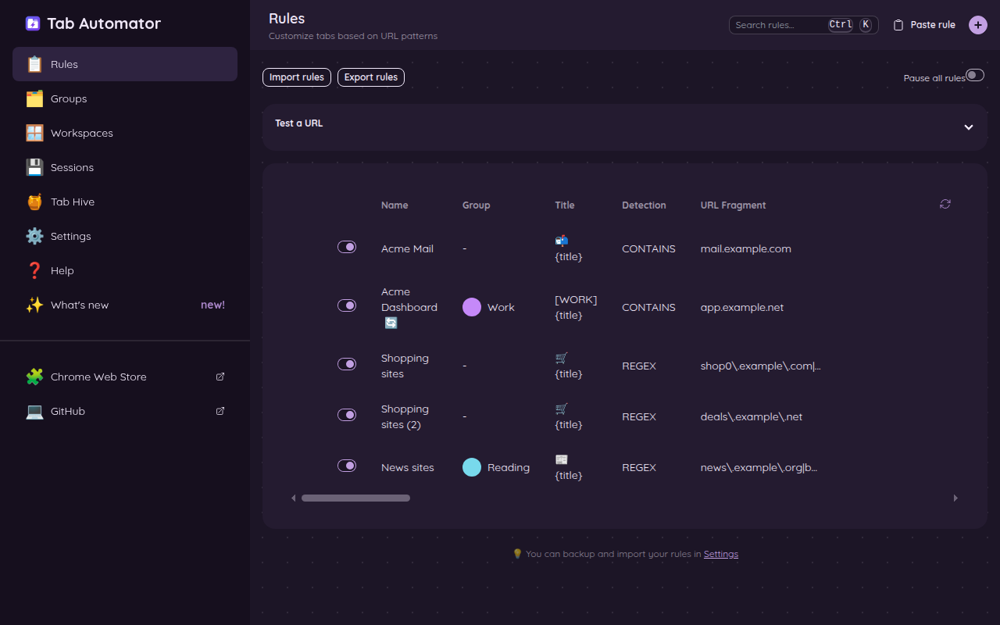
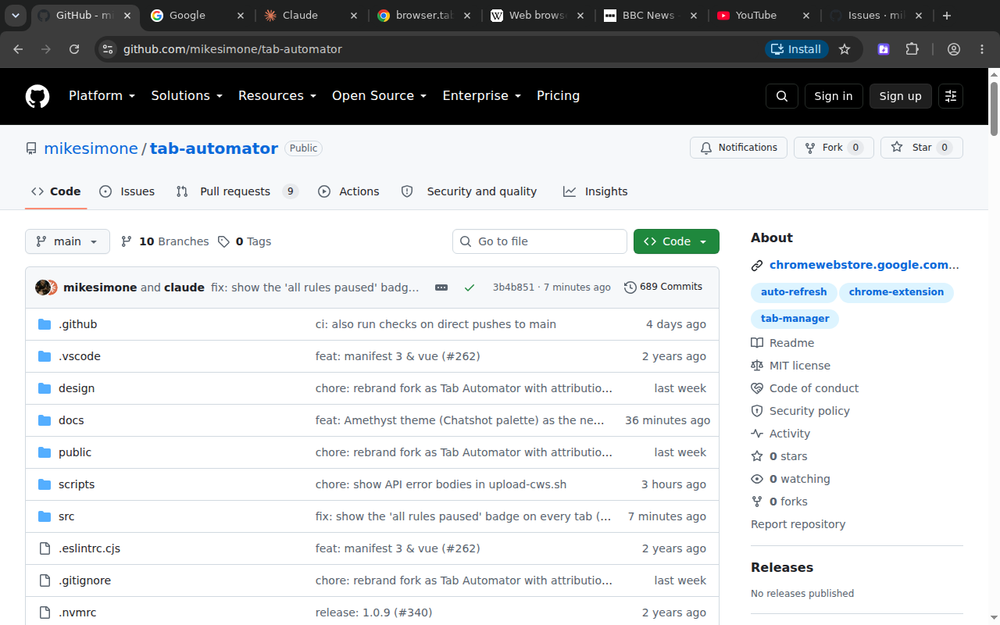
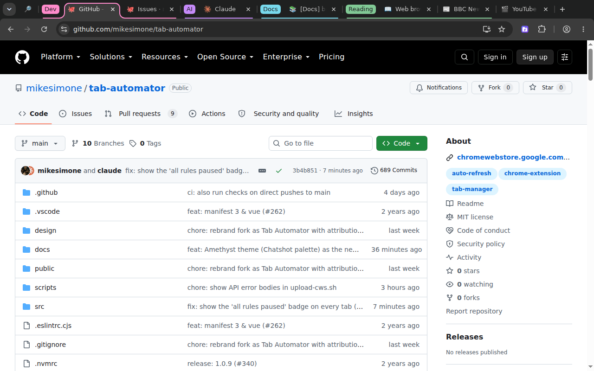

# 1. Getting started

[← Back to the guide](README.md)

## Install Tab Automator

Tab Automator works in Google Chrome. It also works in browsers built on Chrome, such as Microsoft Edge, Brave, Opera and Arc.

1. Open the [Tab Automator page on the Chrome Web Store](https://chromewebstore.google.com/detail/mookagdegldeclccpbjgpbdacipiehff).
2. Click **Add to Chrome**.
3. Chrome asks if you want to add it. Click **Add extension**.

Chrome warns that the extension can "read and change all your data on all websites." That sounds scary, but it's how every tab tool works: it has to see a page to rename its tab. Tab Automator doesn't collect or send anything. Your rules stay on your computer.

## Put the button on your toolbar

Chrome hides new extensions inside the puzzle-piece menu. Pin Tab Automator so it's always one click away:

1. Click the **puzzle piece** 🧩 at the top right of Chrome, next to the address bar.
2. Find **Tab Automator** in the list.
3. Click the **pin** 📌 next to it.

The Tab Automator button now sits on your toolbar.

## The two places you'll use

**1. The side panel.** Click the Tab Automator button on your toolbar. A panel opens on the right side of your browser, next to the page you're looking at. Use it for quick jobs on the page you're on: make a rule for it, change its rule, or add it to a rule you already have. It also has a **Tab Hive** tab that lists tabs Tab Automator closed for you.

**2. The Tab Automator settings page.** This is the full control room: every rule, every group, saved sessions, backups and settings. To open it, do either of these:

- Click the **gear** ⚙️ at the top of the side panel.
- Right-click the Tab Automator button on your toolbar and choose **Options**.

The menu on the left of the settings page has these sections:

| Section | What it's for |
|---|---|
| 📋 **Rules** | See, change, reorder, test and share all your rules. |
| 🗂️ **Groups** | The colored tab groups your rules put tabs into. |
| 🪟 **Workspaces** | Move a group of tabs into its own window. |
| 💾 **Sessions** | Save a set of tabs and open them all again later. |
| 🍯 **Tab Hive** | Tabs closed automatically, and the settings for that. |
| ⚙️ **Settings** | Theme, backups, sync and more. |
| ❓ **Help** | A quick reference. |
| ✨ **What's new** | What changed in each version. |

## The one big idea: rules

Most of what Tab Automator does is done with **rules**.

A rule is like an email filter. An email filter says "when an email comes from my boss, put it in the Work folder." A Tab Automator rule says:

> **When** I open a page from *this website*, **do** *these things* to its tab.

Every rule has two halves:

- **Which pages it's for.** For example, every page on `mail.google.com`.
- **What it does to their tabs.** For example, rename the tab "📬 Email" and pin it.

Tab Automator checks every tab you open against your rules. When a tab matches a rule, it does what the rule says. You don't have to click anything. It just happens, every time, until you turn the rule off.

Here's what a few rules can do to an ordinary set of tabs:

*The same browser before and after. The tabs were renamed, given icons, sorted into colored groups (Dev, AI, Docs and Reading), and the Google tab was pinned.*

## Things you can do without a rule

Some jobs are one-offs, so they don't need a rule. Right-click anywhere on a page to:

- **Reload this tab on a timer.** Choose **🔄 Auto-refresh this tab** and pick how often, from every 30 seconds to once a day. See [Auto-refresh](06-auto-refresh.md#way-1-right-click-for-one-tab-no-rule-needed).
- **Put this tab away for later.** Choose **🍯 Send to Tab Hive**. See [Tab Hive](07-tab-hive.md#put-a-tab-away-yourself).
- **Move this tab, or its whole group, to a new window.** See [Windows and sessions](08-windows-and-sessions.md#presenting-show-only-the-tabs-you-mean-to).

The [right-click menu page](12-right-click-menu.md) lists everything that's there.

## Next step

[Make your first rule →](02-your-first-rule.md)
