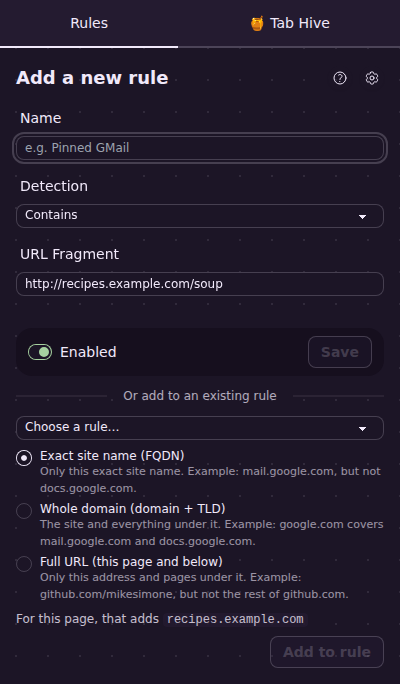
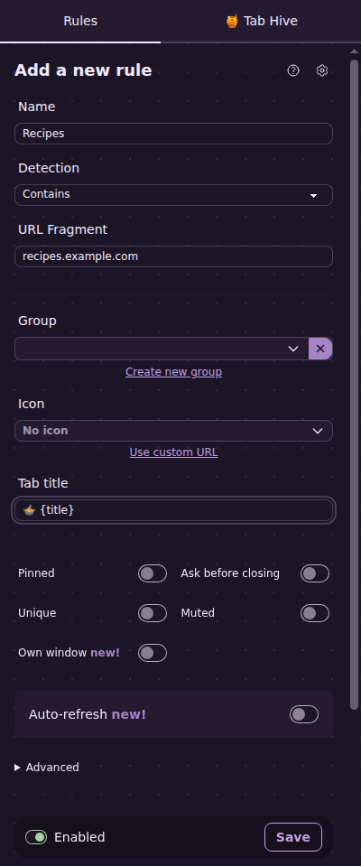
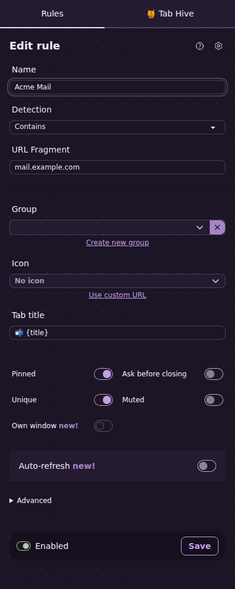

# 2. Make your first rule

[← Back to the guide](README.md)

Let's make a real rule together. In this example, you like cooking, and you want every recipe tab to start with a soup bowl 🍲 so you can spot it right away.

You can follow along with any website you use. Just swap in its name wherever you see `recipes.example.com`.

## Step 1: Open a page from the website

Go to any page on the website, for example a recipe.

## Step 2: Open the side panel

Click the **Tab Automator** button on your toolbar. (If you can't see it, see [Put the button on your toolbar](01-getting-started.md#put-the-button-on-your-toolbar).)

The side panel opens with **Add a new rule** at the top. Tab Automator has already filled in the address of the page you're on.

## Step 3: Fill in the rule

**Name.** Type a name that helps *you* find the rule later, like `Recipes`. Nobody else sees it.

**Detection.** Leave this on **Contains**. It means "any page whose address contains the text below." (The other choices are explained in [Choosing which pages a rule covers](05-which-pages-a-rule-covers.md).)

**URL Fragment.** This is the text Tab Automator looks for in a page's address. It starts out as the full address of the page you're on, like `http://recipes.example.com/soup`. That would only cover this one recipe. You want *every* recipe on the site, so shorten it to just the website's name:

`recipes.example.com`

> **Tip:** The website's name is the part after `https://` and before the next `/`. In `https://www.allrecipes.com/recipe/123/soup`, it's `www.allrecipes.com`. You can usually leave off the `www.`.

As soon as the name and address are filled in, more options appear underneath.

**Tab title.** This is the new name for the tab. Type:

`🍲 {title}`

The `{title}` part means "the page's own title." So a page called "Tomato soup" will show up as "🍲 Tomato soup." If you left out `{title}`, every recipe tab would just say "🍲".

> **How to type an emoji:** On Windows, press the **Windows key** and **.** (period) at the same time. On a Mac, press **Control**, **Command** and **Space** together. Then search for "soup."

Leave everything else alone for now.

## Step 4: Save

Make sure the switch at the bottom says **Enabled**, then click **Save**.

The page reloads, and the tab now starts with 🍲. Open another recipe from the same website and its tab gets the 🍲 too.

## Changing or turning off the rule later

Go back to any recipe page and open the side panel. Because a rule already covers this page, the panel now says **Edit rule** and shows that rule. Change what you like and click **Save**.

To turn a rule off without deleting it, flip its switch to **Disabled** and save. You can also do this from the list of rules on the [settings page](01-getting-started.md#the-two-places-youll-use), where each rule has an on/off switch.

## Making rules from the settings page

You can also make rules on the settings page. Go to **Rules** and click the round **+** button at the top right. You'll get the same form, just wider. One difference: the side panel reloads the page for you when you save, but the settings page doesn't. Reload your tabs yourself afterward (press **F5**, or **Command + R** on a Mac) to see the change.

## A quicker way: rename a tab with a right-click

Right-click anywhere on a page and choose **✏️ Rename Tab**. Type the new name and click **OK**. Tab Automator makes a rule for that exact page address with your new name. It's handy for a one-off, but it only covers that one address, so for a whole website, use the side panel as shown above.

## Next step

[Add a website to a rule you already have →](03-add-a-site-to-a-rule.md)
