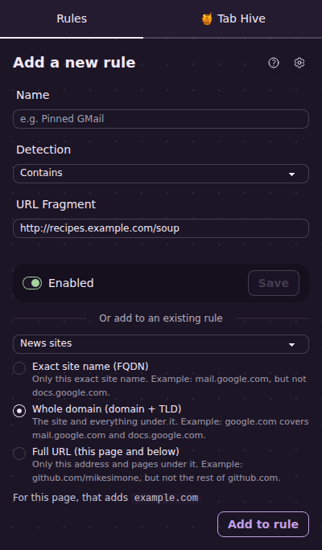
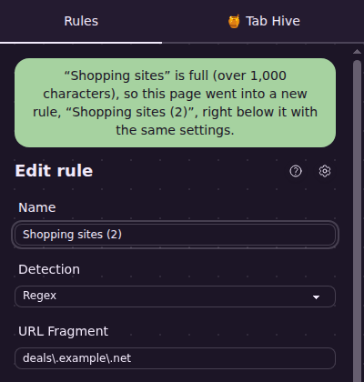

# 3. Add a website to a rule you already have

[← Back to the guide](README.md)

Say you have a rule called "News sites" that puts news tabs in a blue "Reading" group and mutes them. Then you find a new news website you like. You don't need a whole new rule. You can add the new website to the rule you already have, in two clicks.

## How to do it

1. Go to a page on the new website.
2. Click the **Tab Automator** button on your toolbar to open the side panel.
3. Under the new-rule form, find **Or add to an existing rule**.
4. Pick the rule from the list.
5. Choose how much of the website to add (see below).
6. Click **Add to rule**.

The page reloads, and the rule now applies to it.

> This section only shows up on pages that **no rule covers yet**. If a rule already covers the page, the panel shows that rule so you can edit it instead.

## The three choices

Website addresses have layers, a bit like a mailing address has a street, a city and a state. Pick the layer you want the rule to cover. Under the choices, the panel shows exactly what will be added for the page you're on, so you can check before you click.

### Exact site name (FQDN)

**Only this exact website.** Use this most of the time.

*Example:* On `mail.google.com`, this adds `mail.google.com`. The rule covers Gmail, but not Google Docs at `docs.google.com`.

("FQDN" is short for "fully qualified domain name," which is the technical term for a website's full name. You don't need to remember it.)

### Whole domain (domain + TLD)

**This website and every other website that ends with the same name.** Use this when a company spreads one service across several site names and you want to catch them all.

*Example:* On `mail.google.com`, this adds `google.com`. The rule then covers `mail.google.com`, `docs.google.com`, `drive.google.com`, and every other Google site.

("TLD" means the ending, such as `.com`, `.org` or `.co.uk`.)

### Full URL (this page and below)

**Only this part of the website.** Use this when a big website has one area you care about, and you want the rest of the website left alone.

*Example:* On `github.com/mikesimone`, this adds `github.com/mikesimone`. The rule covers `github.com/mikesimone` and anything under it, like `github.com/mikesimone/tab-automator`. It does **not** cover the rest of GitHub, like `github.com` or `github.com/someone-else`.

Another example: on a shopping site, `shop.example.com/garden` would cover the garden section but not the rest of the shop.

## What if the rule isn't a "Regex" rule?

To hold a list of websites, a rule has to use the **Regex** kind of matching. (See [Choosing which pages a rule covers](05-which-pages-a-rule-covers.md) if you're curious.) If the rule you picked uses something else, like **Contains**, the panel tells you it will switch the rule to Regex. You don't have to do anything. The rule keeps covering every page it covered before, plus the new one.

## When a rule gets too long, a new one continues it

Every website you add makes the rule's list a little longer. To keep each rule easy to read and edit, a rule's list stops at about 1,000 characters (roughly 40 to 60 websites).

When you add a website to a full rule, Tab Automator starts a new rule for you, right below the full one. If the full rule is called "News sites," the new one is called **"News sites (2)"**. It has the same settings: same tab name, same icon, same group, same everything. The panel tells you this happened.

From then on, you can keep picking "News sites" when you add websites. Tab Automator puts each new website in "News sites (2)," and starts "News sites (3)" when that one fills up too.

> **Changing settings later?** Each continued rule is its own rule. If you change the tab name or group in "News sites," change "News sites (2)" the same way so they keep matching.

## If something goes wrong

- **"That's already in …"**: The website is already in that rule (or one of its continued rules). Nothing changed.
- **"This page doesn't have a site name that can be added"**: Some pages, like Chrome's own settings pages, don't have a normal website address, so they can't be added to a rule.

[Next: Everything a rule can do →](04-what-a-rule-can-do.md)
