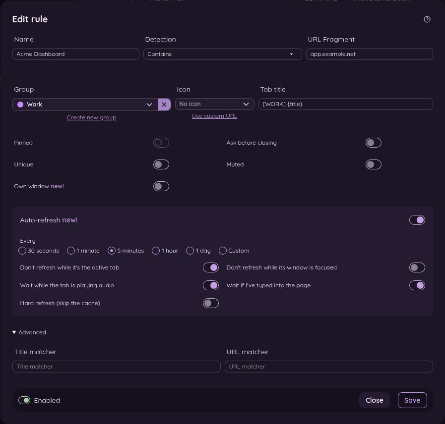
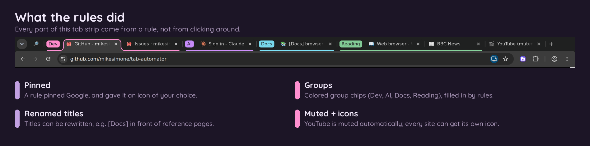
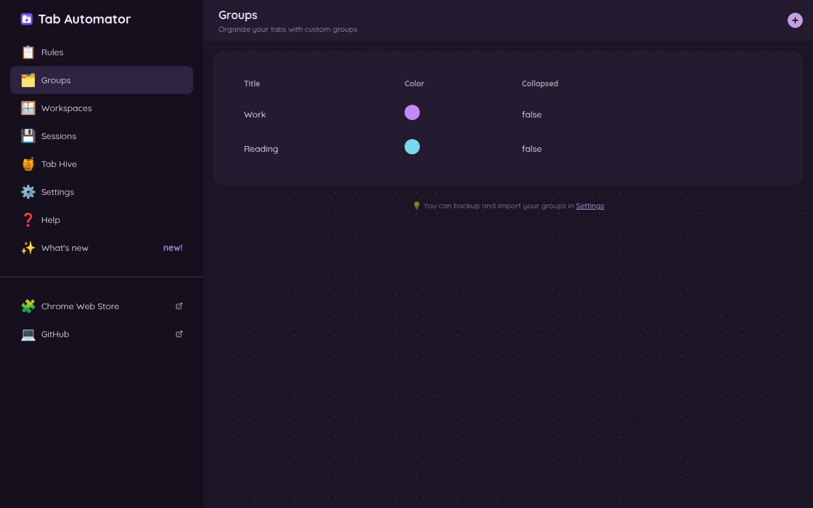

# 4. Everything a rule can do

[← Back to the guide](README.md)

Once you've filled in a rule's name and address, the rest of its options appear. Here's the full rule form, as it looks on the settings page. The side panel has the same options, just stacked in one column.

You can use as many of these as you like in one rule. Anything you leave off stays the way the website normally has it.

## Tab title: give the tab a new name

Type the name you want the tab to have.

- `Email` names every matching tab "Email," whatever the page is.
- `{title}` means "the page's own title." Use it to add to the title instead of replacing it.
- `📬 {title}` puts a mailbox in front of the normal title.
- `[WORK] {title}` puts a label in front.
- `{title} - Personal` adds a note at the end.

**Examples:**

| You type | The page's own title | The tab shows |
|---|---|---|
| `Email` | Inbox (3) - jane@company.com | Email |
| `📬 {title}` | Inbox (3) - jane@company.com | 📬 Inbox (3) - jane@company.com |
| `[TEST] {title}` | Orders · Acme Dashboard | [TEST] Orders · Acme Dashboard |

> **For the curious:** Anything in curly brackets is something Tab Automator copies from the page. `{title}` is the page title. `{h1}` is the page's main heading. People who know web pages can use other page parts here too. See [Questions and fixes](13-questions-and-fixes.md#can-i-use-text-from-the-page-in-the-tab-title).

## Icon: change the little picture on the tab

Every tab has a small picture on its left, called a *favicon*. Changing it makes tabs much easier to tell apart at a glance.

- **Pick one from the list.** Click the **Icon** box. A list opens with built-in pictures (like colored dots: green for "safe," red for "careful") and emojis, sorted into categories. Type in the **Search** box to find one fast, like "star" or "money."
- **Use your own picture.** Click **Use custom URL**. Then either paste the web address of a picture, or copy a picture (from a screenshot, a website or a file) and paste it straight into the box with **Ctrl + V** (**Command + V** on a Mac).
- **Remove it.** Click the **✕** next to the icon to go back to the website's own picture.

## Group: keep related tabs together

Chrome can put tabs in colored, labeled *groups*. Pick a group here, and every tab this rule matches joins it.

- To make a new group, click **Create new group**, give it a name and a color, and save.
- To stop using a group, click the **✕** next to it.
- You can see and edit all your groups under **🗂️ Groups** on the settings page.

## The switches

| Switch | What it does | Good for |
|---|---|---|
| **Pinned** | Pins the tab: it shrinks to just its icon and stays at the far left of the tab strip. | Email, calendar, chat: tabs you keep open all day. |
| **Ask before closing** | If you try to close or reload the tab, the browser asks "Leave site?" first. | Forms you're filling out, online tests, anything you'd hate to lose by accident. |
| **Unique** | Allows only one tab for these pages. If you open a second one, the new one closes. | Email or a web app that gets confused when it's open twice. |
| **Muted** | Silences the tab before it can make any sound. | News and video sites that play videos by themselves. |
| **Own window** | Moves every matching tab into one window of their own. | Keeping dashboards, a project, or a game on a second screen. |
| **Auto-refresh** | Reloads the tab on a timer. | Dashboards, order queues, sports scores. See [Auto-refresh](06-auto-refresh.md). |

A few things to know:

- **Pinned and groups don't mix.** Chrome can't pin a tab that's in a group. If you pick a group, the Pinned switch turns off and grays out.
- **Pinned and Own window don't mix either.** Pinned tabs stay where they are, so Own window grays out while Pinned is on.
- **"Ask before closing" needs a click first.** For your safety, Chrome only shows the "Leave site?" question if you've clicked or typed on the page at least once.

## Advanced: Title matcher and URL matcher

These two boxes are for people who are comfortable with *regular expressions* (a mini-language for patterns in text). Most people never need them. They let you grab pieces of the page title or address and rearrange them in the new title.

**Example:** For GitHub project pages, you can make the tab show the project name first:

- **URL matcher:** `github[.]com/([A-Za-z0-9_-]+)/([A-Za-z0-9_-]+)`
- **Tab title:** `$2 by $1`

For `github.com/mikesimone/tab-automator`, the tab says "tab-automator by mikesimone." `$1` and `$2` are the first and second pieces in parentheses. The **Title matcher** works the same way with the page title, using `@1`, `@2` and so on.

## Enabled or Disabled

The switch at the bottom of every rule turns it on or off. A disabled rule does nothing, but it stays saved, so you can turn it back on any time.

## Don't forget: save, then reload

Click **Save** when you're done. If you saved from the side panel, the page reloads by itself. If you saved from the settings page, reload your tabs to see the change. Tabs that were already open before you made the rule change the next time they load.

[Next: Choosing which pages a rule covers →](05-which-pages-a-rule-covers.md)
