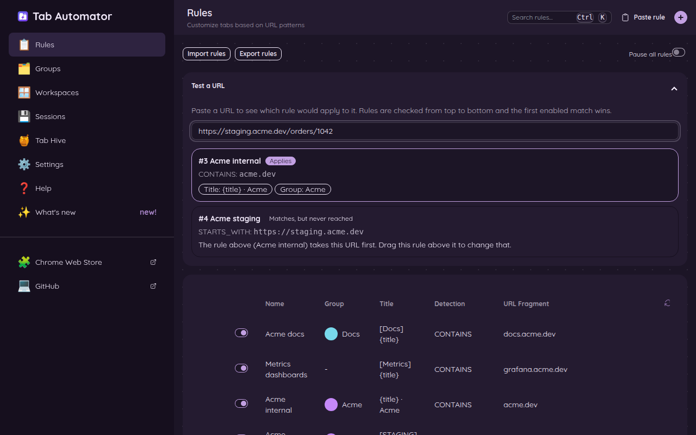
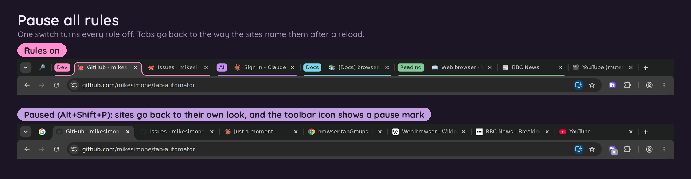

# 5. Choosing which pages a rule covers

[← Back to the guide](README.md)

Every rule has two boxes that decide which pages it covers:

- **URL Fragment**: a piece of a web address, like `mail.google.com`.
- **Detection**: how Tab Automator compares that piece to each page's address.

(A *URL* is a web address, the text in the bar at the top of the browser, like `https://mail.google.com/mail/u/0/`.)

## The five kinds of Detection

The examples below all use the URL Fragment `google.com`.

| Detection | Covers a page when its address… | `google.com` covers… | …but not |
|---|---|---|---|
| **Contains** | has the text anywhere in it | `https://mail.google.com/`, `https://www.google.com/maps` | `https://www.bing.com/` |
| **Starts with** | begins with the text | (nothing, because real addresses begin with `https://`) | |
| **Ends with** | finishes with the text | `https://www.example.com/?go=google.com` | `https://www.google.com/` (it ends with `/`) |
| **Exact** | is exactly the text, nothing more | only the address `google.com` itself | `https://google.com/` |
| **Regex** | fits a pattern (see below) | depends on the pattern | |

**Use Contains almost always.** It's the simplest and does what most people expect.

**Starts with** and **Exact** need the whole address, including the `https://` at the front. For example, a rule with **Starts with** and `https://mail.google.com/mail/u/1/` covers only your second Gmail account. A rule with **Exact** and `https://calendar.google.com/calendar/u/0/r` covers just that one page.

## Regex: one rule for a list of websites

*Regex* (short for "regular expression") is a way to describe patterns in text. You don't need to learn it. You only need two things to make one rule cover several websites:

1. Put a **|** (the "pipe," usually on the key above Enter, typed with Shift) between websites. It means "or."
2. Put a **\\** (backslash) in front of every dot. In a pattern, a plain dot means "any character," so `\.` means "an actual dot."

**Example:** a rule for three news websites:

`bbc\.com|cnn\.com|npr\.org`

You can let Tab Automator write this for you. [Add a website to a rule you already have](03-add-a-site-to-a-rule.md) builds the list automatically and adds the backslashes for you.

## When two rules cover the same page: top wins

Tab Automator checks your rules **from the top of the list down**, and uses the **first** enabled rule that covers the page. Only one rule applies to a tab.

So put specific rules **above** general ones. For example:

1. "Work docs": Contains `docs.google.com` → name it "[WORK] {title}"
2. "Google": Contains `google.com` → put it in the "Google" group

If "Google" were on top, it would catch Google Docs pages first, and "Work docs" would never get a chance.

**To reorder rules,** go to **📋 Rules** on the settings page and drag a rule up or down by its handle on the left.

If a rule can never be reached because a rule above it always catches its pages first, the Rules list shows a ⚠️ next to it. Point at the ⚠️ to see which rule is in the way.

## Test a web address

Not sure which rule covers a page? On the **📋 Rules** page, open **Test a URL** and paste any web address. Tab Automator shows which rule applies, and which other rules match but never get a turn.

## Turn every rule off for a while

Sometimes you want to see websites the normal way, or check whether Tab Automator is causing a problem. You don't have to turn off your rules one by one.

- Press **Alt + Shift + P** (**Command + Shift + P** on a Mac), or
- On the **📋 Rules** page, flip the **Pause all rules** switch.

While paused, no rule changes any tab, and the Tab Automator button shows a pause mark. Tabs that were already changed keep their look until they reload. Press the same keys, or click **Resume**, to turn everything back on.

[Next: Reload tabs automatically →](06-auto-refresh.md)
