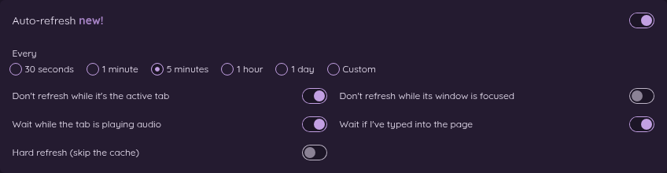

# 6. Reload tabs automatically (Auto-refresh)

[← Back to the guide](README.md)

Some pages only show new information when you reload them: a sales dashboard, an order queue, a ticket list, sports scores, a status page. Auto-refresh reloads those tabs for you on a timer, so they're up to date when you look.

By default, Auto-refresh **never reloads the tab you're looking at**. It waits until you switch away, so it won't yank a page out from under you while you're reading it.

There are two ways to use it. The first one doesn't need a rule at all.

## Way 1: Right-click, for one tab, no rule needed

This is the quickest way, and you don't have to make a rule first. Right-click anywhere on the page, choose **🔄 Auto-refresh this tab**, and pick how often:

- Every 30 seconds
- Every 1 minute
- Every 5 minutes
- Every 1 hour
- Every 1 day

That tab now reloads on that schedule. A 🔄 mark on the Tab Automator toolbar button shows it's on. It keeps going until you close the tab or go to a different website in it. Nothing is saved as a rule, so nothing changes for your other tabs.

Like a rule, a right-click timer waits while you're looking at the tab, and reloads once you switch to another tab. If you want a page reloaded even while you're watching it, use a rule instead (Way 2) and turn off **Don't refresh while it's the active tab**.

To stop it for a while, right-click and choose **🔄 Auto-refresh this tab → ⏸ Pause on this tab**. To start again, choose **▶ Resume on this tab**. To change how often, just pick a different time from the same menu.

## Way 2: In a rule, for every matching tab

If you always want certain pages refreshed, put it in a rule. Every tab the rule covers gets the timer, every time you open it.

1. Make or edit a rule (see [Make your first rule](02-your-first-rule.md)).
2. Turn on the **Auto-refresh** switch.
3. Under **Every**, pick a time, or pick **Custom** and type any number of seconds, minutes or hours (from 30 seconds up to 24 hours).
4. Choose when it should wait (see below), then **Save**.

On the Rules page, rules with Auto-refresh turned on show a 🔄 next to their name. Point at it to see how often they refresh.

## When it waits

Reloading a page at the wrong moment can be annoying, or even lose your work. These switches tell Auto-refresh to hold off:

| Switch | What it means | Starts |
|---|---|---|
| **Don't refresh while it's the active tab** | Waits while you're looking at the tab. | On |
| **Don't refresh while its window is focused** | Waits while you're using the window the tab is in, even if you're on a different tab. Good for a dashboard on a second monitor. | Off |
| **Wait while the tab is playing audio** | Won't cut off a video or music. | On |
| **Wait if I've typed into the page** | Won't wipe out a half-filled form or a comment you're typing. | On |
| **Hard refresh (skip the cache)** | Not a "wait" switch. It makes the reload fetch everything fresh from the website. Turn it on only if a page doesn't seem to update otherwise. | Off |

Auto-refresh also waits while your computer is offline.

When a refresh is due but has to wait, Tab Automator checks again every 30 seconds and refreshes as soon as it's allowed. The timer starts over every time the page loads, so if you reload a page yourself, the countdown begins again.

## Which wins: the right-click or the rule?

The right-click choice. If a tab's rule says "every 5 minutes" and you right-click and choose "every 30 seconds," that tab uses 30 seconds. Pausing from the right-click menu stops both.

[Next: Close forgotten tabs and bring them back →](07-tab-hive.md)
