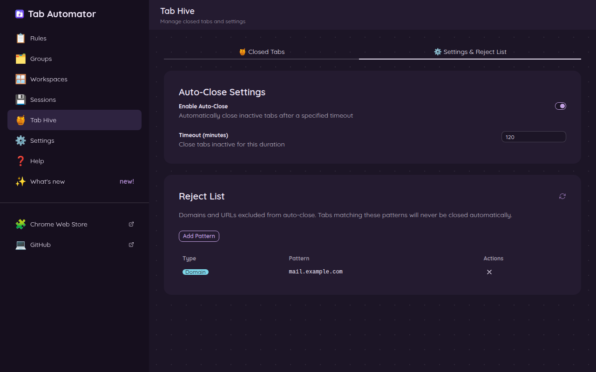
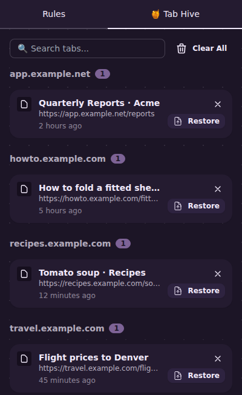

# 7. Close forgotten tabs and bring them back (Tab Hive)

[← Back to the guide](README.md)

If you're the kind of person with 60 tabs open, this one's for you. **Tab Hive** quietly closes tabs you haven't looked at in a while. Nothing is lost: every tab it closes is saved in a list, and you can reopen any of them with one click.

Tab Hive is **off** until you turn it on.

## Turn it on

1. Open the settings page (click the ⚙️ gear in the side panel).
2. Click **🍯 Tab Hive** in the menu on the left, then **⚙️ Settings & Reject List**.
3. Turn on **Enable Auto-Close**.
4. In **Timeout (minutes)**, type how long a tab can sit unused before it's closed. For example, `120` closes tabs you haven't opened in 2 hours. You can pick anything from 1 minute to 1,440 minutes (24 hours).

You'll find the same switch under **⚙️ Settings → Tab Management**.

## What Tab Hive never closes

- The tab you're looking at.
- **Pinned** tabs. (So pin anything you want to keep open all day. See [Everything a rule can do](04-what-a-rule-can-do.md#the-switches).)
- Anything on your **Reject List** (see below).

## Get a closed tab back

Click the Tab Automator button on your toolbar and choose the **🍯 Tab Hive** tab at the top of the side panel. You'll see every tab that was closed, grouped by website, with how long ago it was closed.

- Click **Restore** to open a tab again. It disappears from the list.
- Click the **✕** to remove a tab from the list without opening it.
- Type in **Search tabs** to find a tab by its name or address.
- Click **Clear All** to empty the list.

The same list is on the settings page under **🍯 Tab Hive → Closed Tabs**. Tab Hive remembers the last 100 tabs it closed.

## The Reject List: websites that are never closed

Some tabs should stay open no matter what, like your email or a music player. Add them to the Reject List.

**The quick way:** right-click anywhere on the page and choose **🚫 Exclude from Tab Hive**, then:

- **🌐 Exclude this domain** to protect the whole website, or
- **🔗 Exclude this URL** to protect just this one page.

**The long way:** in **🍯 Tab Hive → ⚙️ Settings & Reject List**, click **Add Pattern**, choose **Domain** (a website, like `github.com`) or **URL** (one exact page), type it in, and click **Add**.

To take something off the list, click the **✕** next to it.

## Put a tab away yourself

Done with a tab for now, but want to come back to it later? Right-click on the page and choose **🍯 Send to Tab Hive**. The tab closes and goes into the list, just as if Tab Hive had closed it.

[Next: Windows, workspaces and saved sessions →](08-windows-and-sessions.md)
