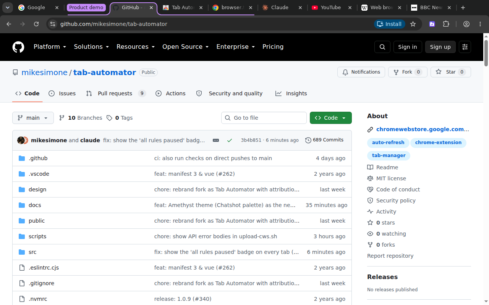
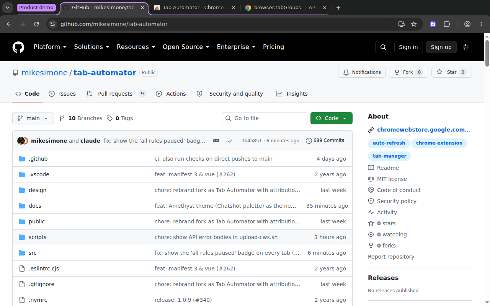
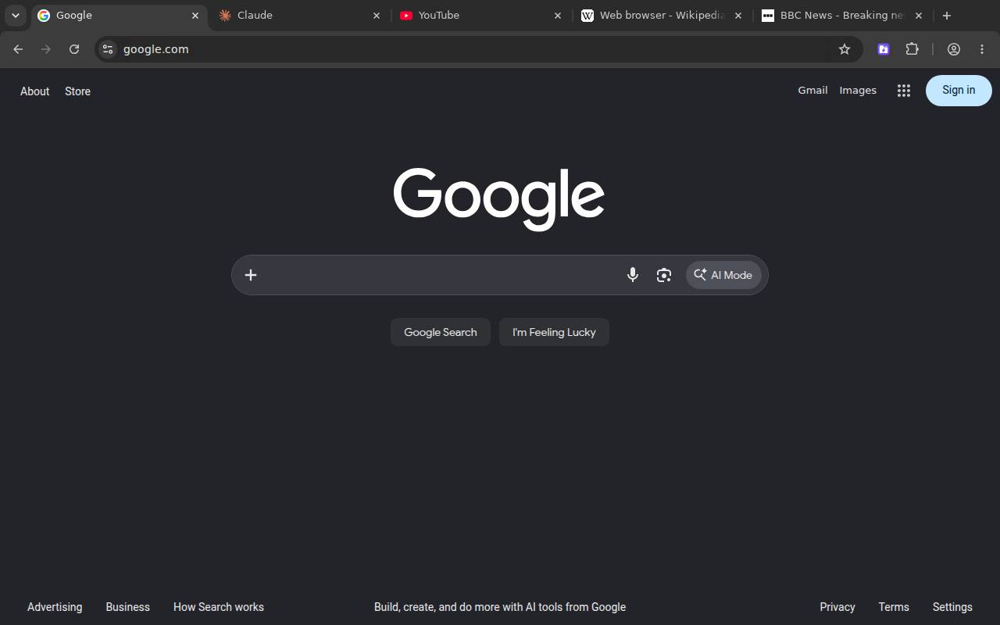
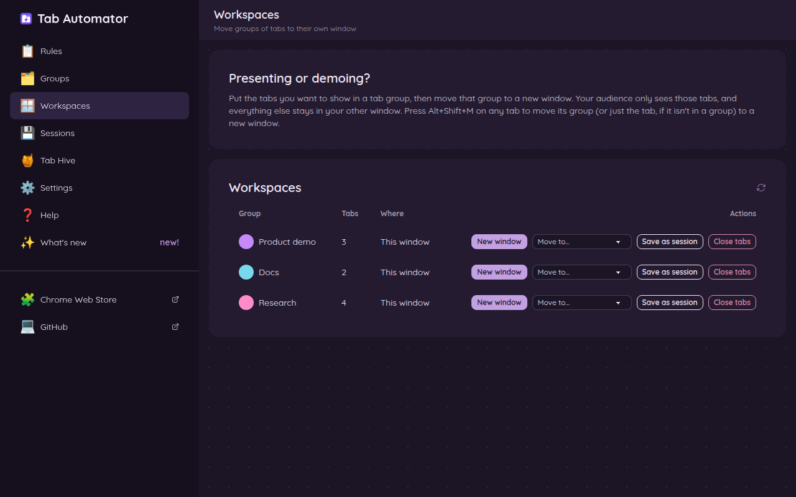
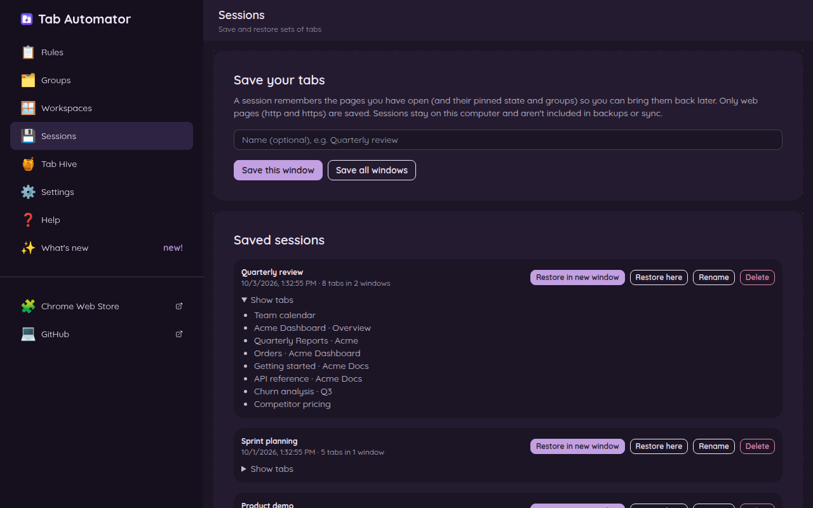
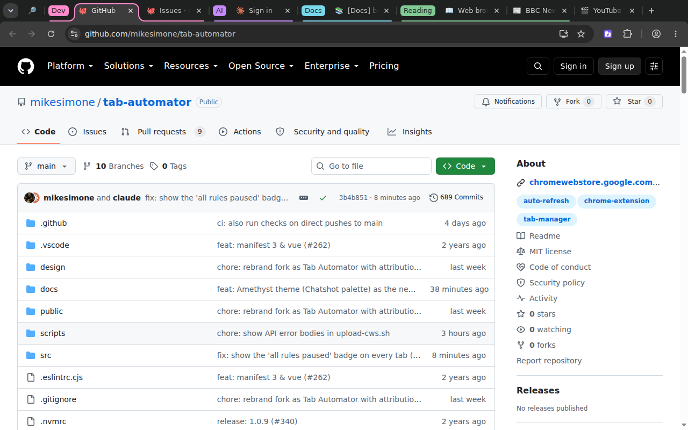
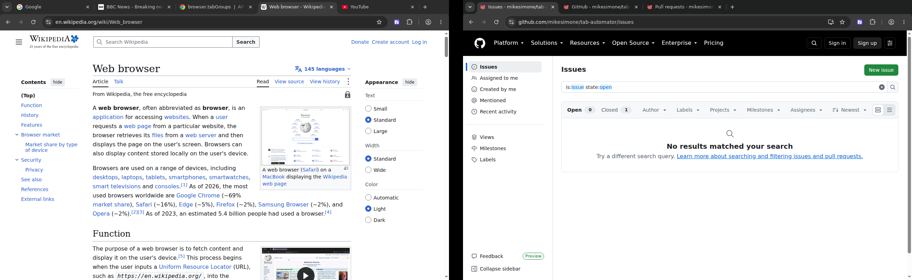
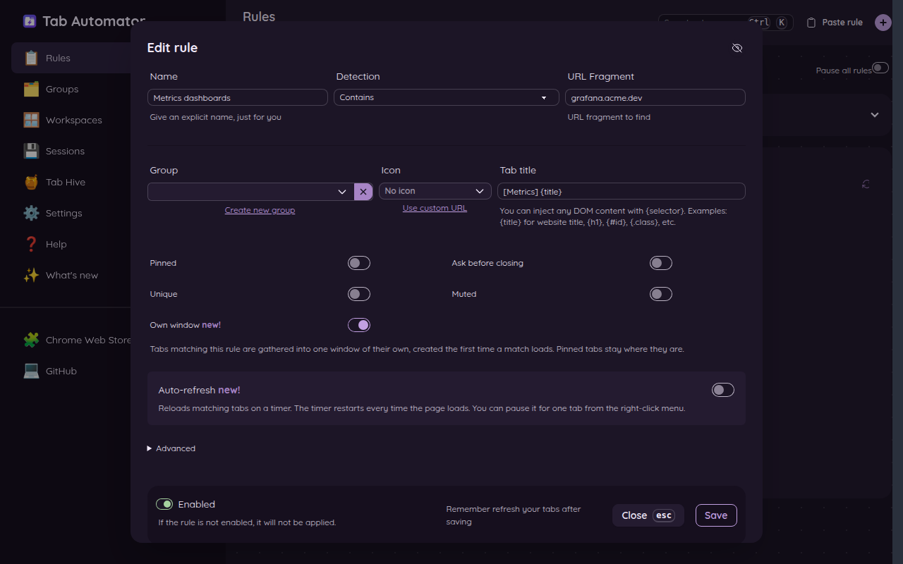

# 8. Windows, workspaces and saved sessions

[← Back to the guide](README.md)

## Presenting? Show only the tabs you mean to

You're about to share your screen in a meeting. You don't want everyone to see your 40 other tabs: your email, your bank, that vacation you're planning. Tab Automator can move just the tabs you want to show into a clean window of their own.

**Step 1: Put the tabs you want to show in a group.** Right-click a tab at the top of the browser, choose **Add tab to new group**, and give the group a name like "Product demo." Then drag the other tabs you want to show into that group.

**Step 2: Move the group to a new window.** Click any tab in the group, then press **Alt + Shift + M**. (Or right-click on the page and choose **🪟 Move tab or group to new window**.)

Share *that* window in your meeting. Your other tabs stay in your original window, out of sight.

If the tab isn't in a group, Alt + Shift + M moves just that one tab.

## Workspaces

On the settings page, **🪟 Workspaces** lists every tab group you have open, in every window. For each one you can:

- **New window**: move the group into a window of its own.
- **Move to…**: move the group into another window you already have open.
- **Save as session**: save the group so you can open it again later (see below).
- **Close tabs**: close every tab in the group.

## Sessions: save a set of tabs, open them all later

A *session* is a saved set of tabs. It's great for things you come back to: "Monthly report," "Trip planning," "Taxes." Close all those tabs when you're done, and bring them all back in one click next time.

**To save,** go to **💾 Sessions** on the settings page. Type a name (like "Quarterly review"), then click:

- **Save this window** to save the tabs in your current window, or
- **Save all windows** to save every tab in every window.

To save just one group, use **Save as session** on the **🪟 Workspaces** page.

**To open a saved session,** go to **💾 Sessions** and click:

- **Restore in new window** to open it in a fresh window, or
- **Restore here** to add its tabs to the window you're in.

Pinned tabs, groups and group colors all come back.

You can also **Rename** or **Delete** a session, or click **Show tabs** to see what's in it.

Things to know:

- Only normal web pages are saved. Browser pages like Settings or the Downloads list are skipped.
- Sessions are saved on this computer only. They aren't synced to your other computers or included in backups.

## Own window: keep certain websites in a window of their own

Turn on **Own window** in a rule, and every tab that rule matches gathers into one window. The first matching tab you open gets a new window. Every matching tab after that joins it.

Use it to keep all your dashboards on a second monitor, or to keep a project's tabs away from everything else.

- Pinned tabs stay where they are, so you can't use Pinned and Own window in the same rule.
- If you close that window, the next matching tab starts a new one.

## Merge all windows into one

Got windows scattered everywhere? Press **Alt + Shift + W** (**Command + Shift + W** on a Mac), or right-click on a page and choose **🪟 Merge All Windows**. Every tab from every window moves into the window you're using.

[Next: Find any tab fast, and keyboard shortcuts →](09-search-and-shortcuts.md)
