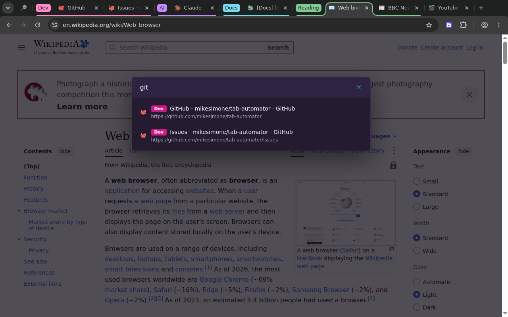
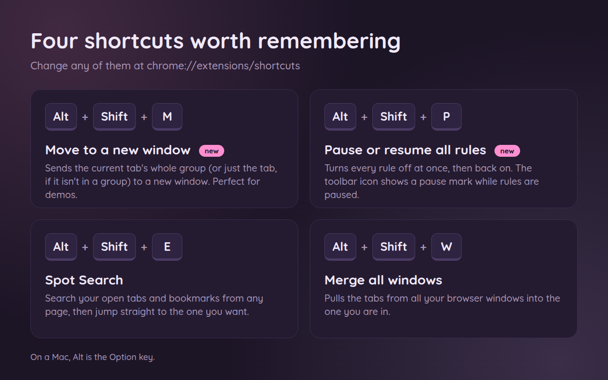

# 9. Find any tab fast, and keyboard shortcuts

[← Back to the guide](README.md)

## Spot Search: find any open tab or bookmark

When you have so many tabs that their names are just tiny icons, finding the one you want is a chore. Spot Search lets you type a word and jump straight to it.

1. On any web page, press **Alt + Shift + E** (**Command + Shift + E** on a Mac).
2. A search box pops up in the middle of the page. Start typing part of a tab's name, its web address, or its group name.
3. The list narrows as you type. It shows your open tabs and your bookmarks.
4. Use the **↑** and **↓** arrow keys to pick one, and press **Enter**. Tab Automator switches to that tab, or opens the bookmark.
5. Press **Esc** to close the search box without picking anything.

> Spot Search works on normal web pages. It can't open on Chrome's own pages (like Settings or the New Tab page), because Chrome doesn't let extensions add things there.

## All the keyboard shortcuts

| Press (Windows, Linux, ChromeOS) | Press (Mac) | What it does | Learn more |
|---|---|---|---|
| **Alt + Shift + E** | **Command + Shift + E** | Spot Search: find a tab or bookmark | Above |
| **Alt + Shift + P** | **Command + Shift + P** | Pause or resume all rules | [Turn every rule off for a while](05-which-pages-a-rule-covers.md#turn-every-rule-off-for-a-while) |
| **Alt + Shift + M** | **Alt + Shift + M** (Alt is the Option key) | Move this tab, or its whole group, to a new window | [Presenting?](08-windows-and-sessions.md#presenting-show-only-the-tabs-you-mean-to) |
| **Alt + Shift + W** | **Command + Shift + W** | Merge all windows into one | [Merge all windows](08-windows-and-sessions.md#merge-all-windows-into-one) |

"Alt + Shift + E" means: hold down **Alt** and **Shift**, then tap **E**.

## A shortcut doesn't work, or you want different keys

Another program or extension may already be using those keys, or Chrome may have kept them for itself. You can change any of them:

1. Type `chrome://extensions/shortcuts` in the address bar and press **Enter**.
2. Find **Tab Automator**.
3. Click the pencil ✏️ next to a shortcut, then press the keys you want to use instead.

[Next: Back up your rules, sync them, and share them →](10-backup-sync-share.md)
