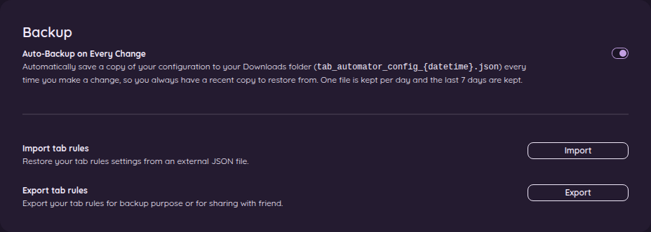
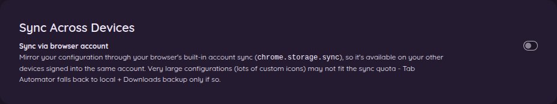
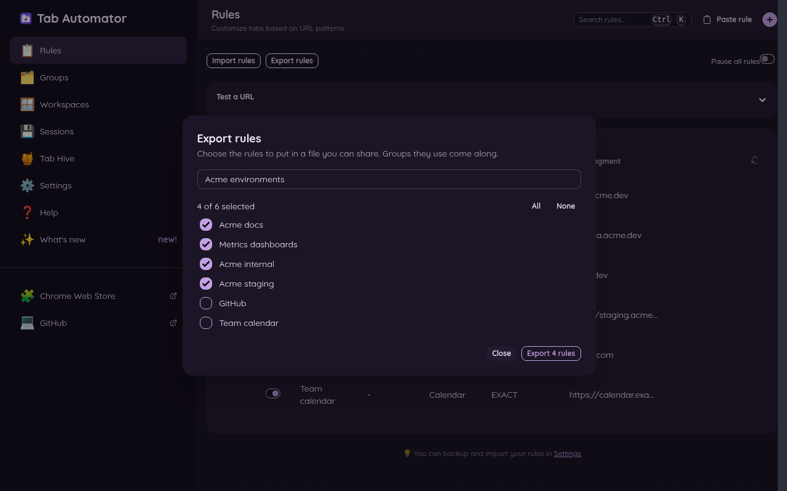

# 10. Back up your rules, sync them, and share them

[← Back to the guide](README.md)

After you've set up a dozen rules, you'll want to keep them safe. All of this is under **⚙️ Settings** on the settings page, except sharing, which is on the **📋 Rules** page.

## Automatic backup (recommended)

Turn on **Auto-Backup on Every Change**. From then on, every time you add, change or delete a rule, Tab Automator saves a copy of all your settings into your **Downloads** folder. The file is named like this:

`tab_automator_config_2026-10-05_14-30-00.json`

It keeps one file per day (and updates it as you make more changes that day), and deletes files older than 7 days, so your Downloads folder doesn't fill up.

If your browser is ever reset, or you make a mistake you can't undo, you'll have a recent copy to bring back.

## Save a copy yourself (Export)

Click **Export** next to **Export tab rules**. Tab Automator saves a file with all your rules and groups into your Downloads folder. Keep it somewhere safe, like a USB stick or cloud storage.

## Bring rules back from a file (Import)

1. Click **Import** next to **Import tab rules**.
2. Choose the file (a backup, or one you exported earlier).
3. Pick one:
   - **Import & Replace**: throws away the rules you have now and uses the ones in the file. Use this to restore a backup.
   - **Import & Merge**: keeps the rules you have and adds the ones in the file.

Files from older versions of Tab Automator still work.

## Sync between your computers

If you sign in to Chrome with the same account on more than one computer, turn on **Sync via browser account** on each of them. Your rules, groups and settings will follow you. Click **Sync Now** if you don't want to wait.

Chrome only allows a small amount of synced data per extension. If you use lots of custom pictures as tab icons, your settings may be too big to sync. If that happens, Tab Automator tells you and keeps using the local copy and backups instead, so nothing breaks.

## Share some rules with a friend or coworker

Maybe you made a great set of rules for your team's tools and want to give them to everyone. On the **📋 Rules** page:

**To share:**

1. Click **Export rules**.
2. Check the rules you want to share. (Click **All** or **None** to speed things up.)
3. Give the set a name if you like, such as "Team tools."
4. Click **Export**. Tab Automator saves a file you can email or post. Any groups those rules use come along.

**To use rules someone shared with you:**

1. Click **Import rules** and choose the file.
2. Tab Automator shows every rule in the file. Uncheck any you don't want.
3. Click **Add**.

Shared rules go **below** your own rules, so they never take over something you already set up.

> **Only import files from people you trust.** A rule can rename tabs, close duplicate tabs and ask before closing tabs, so a bad file could be a real nuisance.

[Next: Settings →](11-settings.md)
