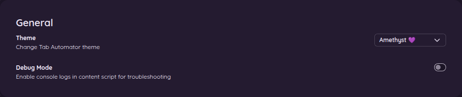
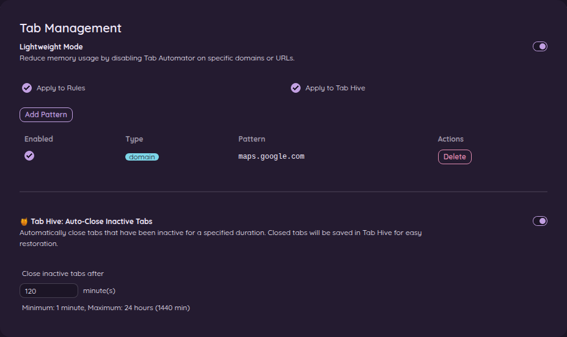

# 11. Settings

[← Back to the guide](README.md)

Open the settings page (click the ⚙️ gear in the side panel) and choose **⚙️ Settings** in the menu on the left.

## General

**Theme** changes the colors of Tab Automator's own screens (not your websites). Choices include **Amethyst 💜** (the default, dark purple), **Amethyst Light**, **Honey 🐝**, **Dim**, **Dark**, **Light**, **Cupcake**, **Valentine** and **Halloween**. Pick whatever is easiest on your eyes.

**Debug Mode** is for tracking down problems. Leave it off unless someone helping you with a problem asks you to turn it on.

## Tab Management

### Lightweight Mode

Tab Automator does a little bit of work on every page you visit. On very heavy websites (big online maps, design tools, games), you might want it to stay out of the way completely.

1. Turn on **Lightweight Mode**.
2. Click **Add Pattern**.
3. Choose **Domain** and type a website name, like `maps.google.com`. (**Regex** is for advanced patterns; see [Choosing which pages a rule covers](05-which-pages-a-rule-covers.md#regex-one-rule-for-a-list-of-websites).)
4. Click **Add Pattern** in that box to save it.

The two checkboxes decide what Tab Automator skips on those websites:

- **Apply to Rules**: no rule changes those tabs.
- **Apply to Tab Hive**: Tab Hive never closes those tabs.

Each pattern has its own checkbox, so you can switch one off without deleting it.

### Tab Hive: Auto-Close Inactive Tabs

The same on/off switch and timer as on the Tab Hive page. See [Close forgotten tabs and bring them back](07-tab-hive.md).

## Backup and Sync Across Devices

See [Back up your rules, sync them, and share them](10-backup-sync-share.md).

## Danger zone

**Delete all rules** removes every rule you have. There's no undo, except restoring from a backup, so make sure you have one first.

## What's new

**✨ What's new** in the menu lists what changed in each version of Tab Automator, newest first. When a menu item says **new!**, that's where to look.

[Next: The right-click menu →](12-right-click-menu.md)
