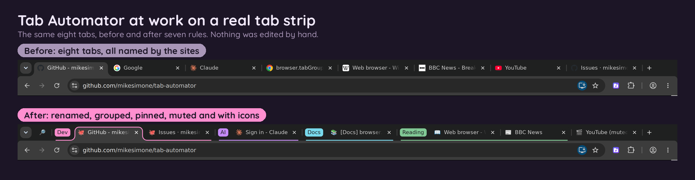

# Tab Automator User Guide

Tab Automator makes your browser tabs easier to live with. You tell it what you want once, and it keeps doing it for you. For example:

- Give a tab a shorter or clearer name, like "📬 Work email" instead of "Inbox (3) - jane.doe@company.com - Company Mail".
- Put all your work tabs together in a purple group called "Work".
- Keep your email tab pinned to the left edge so it never gets lost.
- Reload a dashboard every 5 minutes so it's always up to date.
- Close tabs you forgot about, and bring them back later if you need them.

This guide explains every feature in plain language, with pictures. You don't need to know anything technical to use it. Start with the first two pages, then jump to whatever you need.

*Top: tabs without Tab Automator. Bottom: the same tabs with a few rules. They're renamed, grouped by color, the Google tab is pinned, and YouTube is muted.*

## Start here

1. [Getting started](01-getting-started.md): install it, find it, and learn the one idea everything is built on.
2. [Make your first rule](02-your-first-rule.md): a step-by-step example you can follow along with.

## Everyday features

3. [Add a website to a rule you already have](03-add-a-site-to-a-rule.md)
4. [Everything a rule can do](04-what-a-rule-can-do.md): names, icons, groups, pinning, muting and more
5. [Choosing which pages a rule covers](05-which-pages-a-rule-covers.md)
6. [Reload tabs automatically (Auto-refresh)](06-auto-refresh.md)
7. [Close forgotten tabs and bring them back (Tab Hive)](07-tab-hive.md)

## Getting more out of it

8. [Windows, workspaces and saved sessions](08-windows-and-sessions.md)
9. [Find any tab fast, and keyboard shortcuts](09-search-and-shortcuts.md)
10. [Back up your rules, sync them, and share them](10-backup-sync-share.md)
11. [Settings](11-settings.md)
12. [The right-click menu](12-right-click-menu.md)

## Help

13. [Questions and fixes](13-questions-and-fixes.md)
14. [Word list](14-word-list.md): what the computer words in this guide mean

---

Tab Automator is free and open source. If something in this guide is confusing or wrong, please [open an issue on GitHub](https://github.com/mikesimone/tab-automator/issues) and tell us. You can also [rate it on the Chrome Web Store](https://chromewebstore.google.com/detail/mookagdegldeclccpbjgpbdacipiehff).
